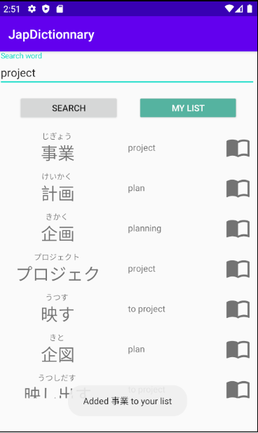

# JapDictionnary  
### Description  
Cette application sert de dictionnaire Anglais vers Japonais ainsi que Japonais vers Anglais.  
Les traductions donnent : Les __kanjis__ (idéogrammes) associés à chaque mots, ainsi que les __kanas__ pour la prononciation.  

### Composition de l'application
L'application est composé d'une activité et fait appel à l'API REST [Jisho](https://jisho.org). Les traductions sont affichées dans un __Recycler view__ où chaque élément contient 3 informations (Kanji, Kana, Traduction) et 1 bouton.  
L'application est développée selon une architecture __MVVM__ et respecte la __Clean Architecture__. De plus, toutes les données enregistrés (voir : Fonctionnalités - Dictionnaire personnalisé) sont stockés dans une base de données __Room__.  

  

### Fonctionnalités
#### * Traduction
L'activité contient un champs de texte, l'utilisateur peut y rentrer des mots (en Anglais, ou en Japonais) et faire une recherche. Une liste de traduction possibles s'affichent alors à l'écran.  
  
  
  
#### * Dictionnaire personnalisé
L'application permet de créer son propre dictionnaire de mots personnalisés. Celà peut notamenet servir pour lister les kanjis que l'ont connait pour pouvoir les réviser facilement ! Pour ajouter un mot à sa liste, il suffit de cliquer sur le livre ouvert à droite de la traduction d'un mot  
  

Vous retrouverez alors tous vos mots enregistrés en cliquant sur le bouton "My List"  

